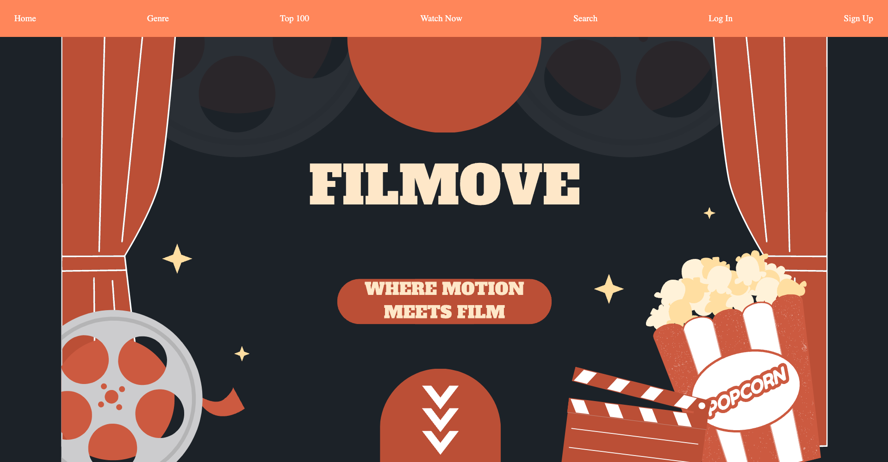
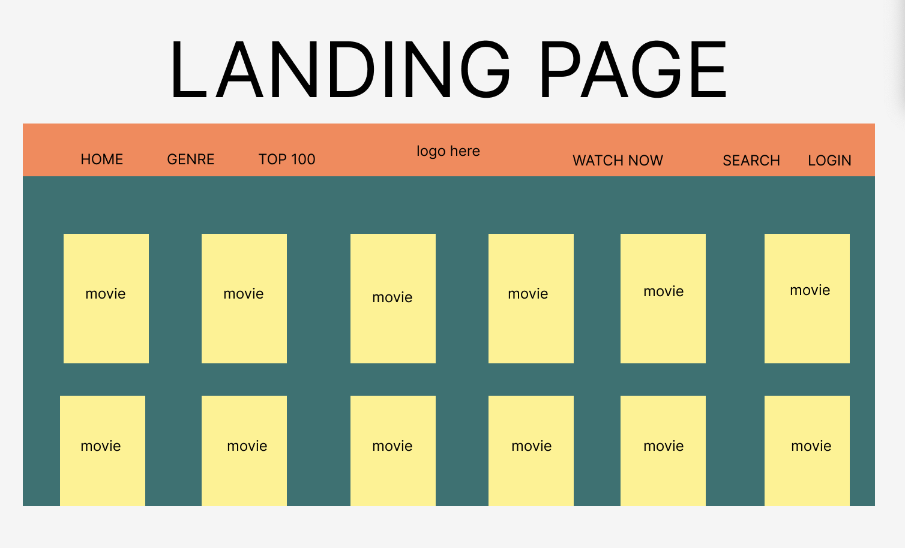
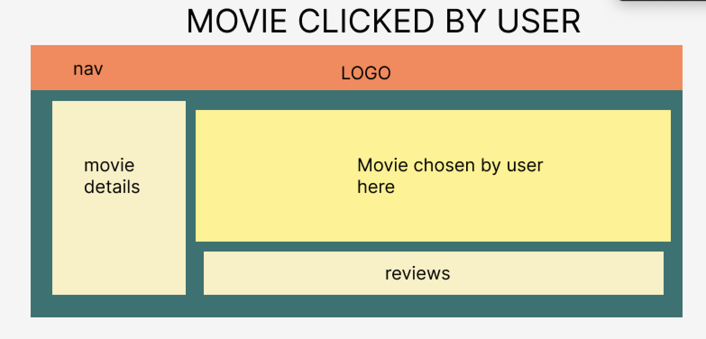
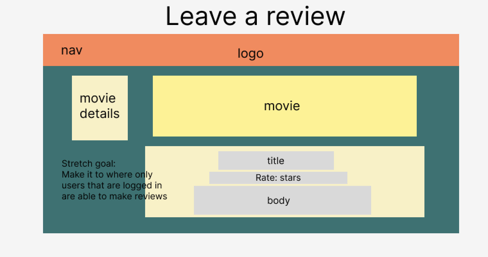
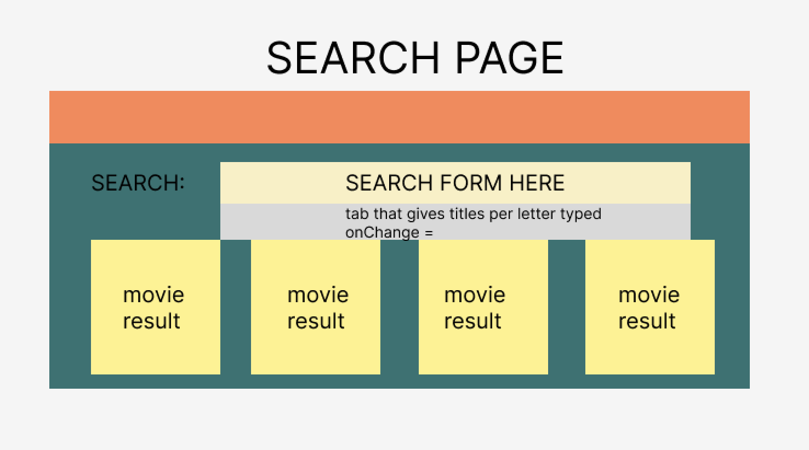
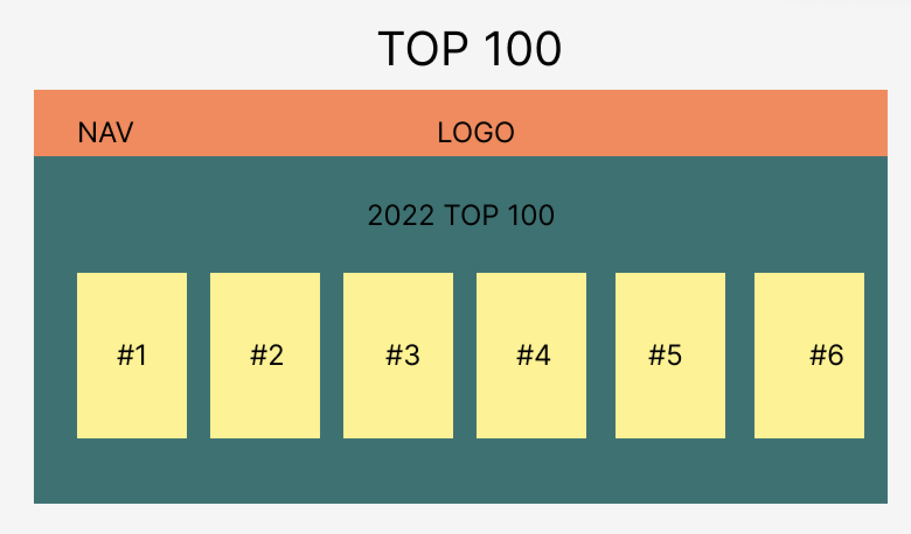

Hi There!  Welcome to FilMove!
========================================================================================================================================

### FilMove is a fullstack application built to enchace user experience when browsing through movies! Filmove is created through React for frontend functionality and Express for backend. 

## Link to FilMove App
(placeholder)
## Technologies Used
* MongoDB
* Express
* Node
* React 
* Javascript
* CSS
* Handtrack.js
* Visual Studio Code
* Trello

## Installation Instructions
1. Download and install VS Code. [Click here for VS Code download](https://code.visualstudio.com/Download)
2. Download and install Node. [Click here for Node download](https://nodejs.org/en/download)
3. Download and install Vite. [Click here for Node download](https://vitejs.dev/config/)
4. On your terminal, install the following:
* git clone FilMove repo
* npm create vite@latest (choose React & Javascript)
* npm install react-router-dom
* npm install cors
* npm install i
5. Run frontend using npm run frontend. 
    * Press O to open browser automatically from VS terminal
6. Run backend using npm run backend
    * Backend will be on localhost:3000

## Wireframes

## USER STORIES
As an end user, I desire the capability to navigate FilMove utilizing hand-motion detection, and seamlessly search for movies by genre. Additionally, I seek the convenience of being presented with a recommended movie upon clicking the "Watch Now" button, thereby eliminating the need to spend excessive time searching for content. Moreover, I expect to have access to comprehensive movie details for the content I choose to view.

## Major Hurdles
I would say my major hurdles was just making sure my routes in backend and frontend for CRUD operations were the same.

## Next Steps
My next plan for my app is to create more hand motion features and develop it to be TV friendly so I can cast my app to the tv.

